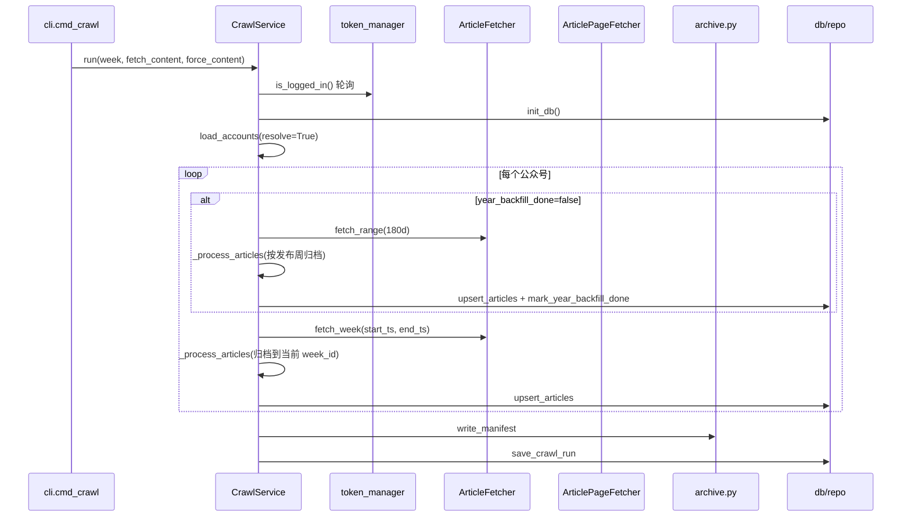

# 爬虫运行时流水线

> 对应代码：`CrawlService.run()` → `_process_articles()` → `_run_year_backfill()`

## 时序图



## 逐步说明

### Step 0：CLI 解析

```bash
python -m worker crawl [--week last|2026-W25] [--no-wait] [--wait-timeout 3600] [--no-content] [--force-content]
```

| 参数 | 默认 | 作用 |
|------|------|------|
| `--week` | `last` | 上一自然周（UTC+8 ISO week） |
| `--no-wait` | false | 无 token 立即失败 |
| `--wait-timeout` | 3600 | 等待 token 秒数 |
| `--no-content` | false | 只拉列表/摘要，不抓正文 |
| `--force-content` | false | 忽略本地 txt 缓存，强制重抓正文 |

### Step 1：登录门禁

```python
# service.py _ensure_login
while not token_manager.is_logged_in():
    sleep(poll_interval)  # 默认 60s
```

crawl **不会**触发登录；需事先 `python -m worker login --email`。

### Step 2：时间窗

```python
start_ts, end_ts, week_id = week_range(week)   # 本周采集
year_start, year_end, _ = year_range()         # 180天回填
```

`week_id` 示例：`2026-W25`  
归档根目录：`data/archive/2026-W25/`

### Step 3：凭证与账号

```python
creds = auth_manager.get_credentials()  # {token, cookie, ...}
accounts = load_accounts(resolve=True, searcher=BizSearcher)
```

缺 `fakeid` 的条目会调 `searchbiz` API 搜索并**写回** `accounts.yaml`。

### Step 4：近半年回填（每号一次）

触发：`accounts.year_backfill_done = false`

```python
articles = fetcher.fetch_range(fakeid, year_start, year_end, max_pages=80)
archive_dir_for = lambda a: ARCHIVE_ROOT / week_id_from_ts(a["publish_time"])
```

**注意**：回填文章写入**发布日期所在周**的文件夹，不是当前 crawl 周。

### Step 5：本周列表

```python
articles = fetcher.fetch_week(fakeid, start_ts, end_ts)
```

API：`cgi-bin/appmsgpublish`，带 token+cookie。

### Step 6：`_process_articles` 核心循环

对每篇文章 `a`：

```
1. txt_path = article_txt_path(archive_dir, nickname, a)
2. if fetch_content and link:
     if 非 force 且 is_detailed_archive(txt_path):
         load_cached_content(a, txt_path)  → skip_write=True
     else:
         page_fetcher.enrich(a)            → public → token
3. if not skip_write:
     write_article_txt(archive_dir, nickname, a)
4. （外层）upsert_articles(fakeid, articles)
```

### Step 7：manifest + crawl_runs

`manifest.json` 含：`week_id`, 时间范围, `accounts`, `stats`（按号计数、正文来源 public/token/cached 等）

---

## `_process_articles` 返回值

| 字段 | 含义 |
|------|------|
| `content_ok` | `content_fetched=true` 篇数 |
| `content_fail` | 有 link 但抓取失败 |
| `content_public` | 来源 `public` |
| `content_token` | 来源 `token` |
| `cached` | 本地 txt 跳过抓取 |
| `db_backfill` | txt 有正文但 DB 无记录（将从 txt 数据 upsert） |
